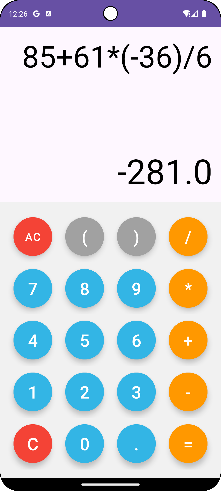

# Android Calculator App

A simple yet functional calculator app built using **Java** and **XML** in **Android Studio**. This app performs basic arithmetic operations and supports negative numbers for both input and result.

---

## 🚀 Features

- Addition, Subtraction, Multiplication, and Division
- Support for negative number inputs and results
- Clear (`C`) and backspace functionality
- All clear (`AC`) functionality
- Real-time result calculation
- User-friendly interface using modern UI component

---

## 📱 Screenshots

 
---

## 🛠️ Tech Stack

- **Language:** Java
- **UI Design:** XML
- **IDE:** Android Studio
- **Min SDK:** 21
- **Target SDK:** 34

---

## 🧠 Negative Number Support

The app handles negative numbers by:

- Allowing the user to prepend `-` to a number
- Using a **real math expression parser** (not JavaScript engine)
- Handling edge cases like `-5 + -3` or `--4`

---

## 📥 How to Use

1. Clone the repository:
   ```bash
   git clone https://github.com/yourusername/CalculatorApp.git

2. Open in Android Studio.

3. Build and run the app on an emulator or physical device.

---

## 🧪 sample Expressions
1. -5 + 4= -1
2. (-3) + 4 = 6
3. 5 / -1 = -5
4. -10 - -20 = -30

---

## 🤝 Contributing
Contributions are welcome! Feel free to open issues or pull requests.

---
## 👤 Author
- Aryan Jadhav
- 📧 Mail -  aryanjadhav4297@gmail.com
- 🔗LinkedIn Account- https://www.linkedin.com/in/aryan-jadhav-6b4891274
- 🔗LinkedIn Post -https://www.linkedin.com/posts/aryan-jadhav-6b4891274_prodigyinfotech-internship-androiddevelopment-activity-7346822241738792960-nhWs?utm_source=share&utm_medium=member_desktop&rcm=ACoAAEMMw6gBRs0KBy3dgxSLHPz1aiBjg1MiwcM
